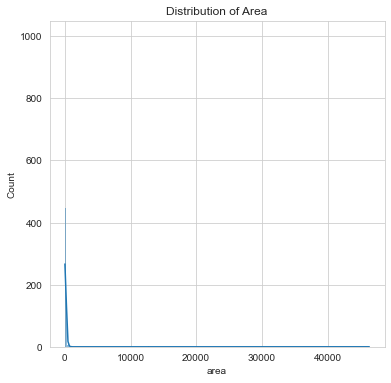
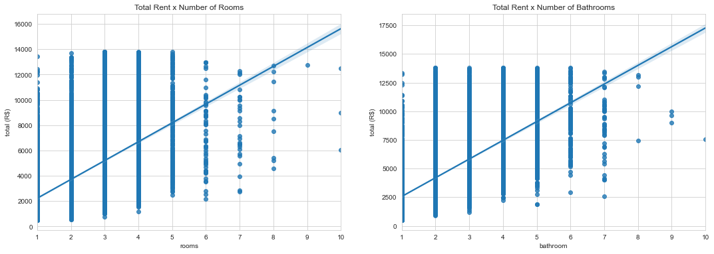

# Business Proposal

<p align="center">
  
</p>

Build a model to predict the cost of renting a certain property, such a model can be of extreme help to the client so that he can create new business strategies and have a better view of the market, depending on the region or period.

Beyond that, this study seeks to answer some hypotheses such as:

• What is the distribution of the total rent for the property?
• What is the relationship between the values of rent and the location of the property?
• What is the relationship, if any, between features and property values?

The data for carrying out this project was taken from: https://www.kaggle.com/rubenssjr/brasilian-houses-to-rent?select=houses_to_rent_v2.csv

# 1.0 Dataset

<table border="1" class="dataframe">
  <thead>
    <tr style="text-align: right;">
      <th></th>
      <th>City</th>
      <th>area</th>
      <th>rooms</th>
      <th>bathroom</th>
      <th>parking spaces</th>
      <th>floor</th>
      <th>animal</th>
      <th>furniture</th>
      <th>hoa (R$)</th>
      <th>rent amount (R$)</th>
      <th>property tax (R$)</th>
      <th>fire insurance (R$)</th>
      <th>total (R$)</th>
    </tr>
  </thead>
  <tbody>
    <tr>
      <th>0</th>
      <td>São Paulo</td>
      <td>70</td>
      <td>2</td>
      <td>1</td>
      <td>1</td>
      <td>7</td>
      <td>acept</td>
      <td>furnished</td>
      <td>2065</td>
      <td>3300</td>
      <td>211</td>
      <td>42</td>
      <td>5618</td>
    </tr>
    <tr>
      <th>1</th>
      <td>São Paulo</td>
      <td>320</td>
      <td>4</td>
      <td>4</td>
      <td>0</td>
      <td>20</td>
      <td>acept</td>
      <td>not furnished</td>
      <td>1200</td>
      <td>4960</td>
      <td>1750</td>
      <td>63</td>
      <td>7973</td>
    </tr>
    <tr>
      <th>2</th>
      <td>Porto Alegre</td>
      <td>80</td>
      <td>1</td>
      <td>1</td>
      <td>1</td>
      <td>6</td>
      <td>acept</td>
      <td>not furnished</td>
      <td>1000</td>
      <td>2800</td>
      <td>0</td>
      <td>41</td>
      <td>3841</td>
    </tr>
    <tr>
      <th>3</th>
      <td>Porto Alegre</td>
      <td>51</td>
      <td>2</td>
      <td>1</td>
      <td>0</td>
      <td>2</td>
      <td>acept</td>
      <td>not furnished</td>
      <td>270</td>
      <td>1112</td>
      <td>22</td>
      <td>17</td>
      <td>1421</td>
    </tr>
    <tr>
      <th>4</th>
      <td>São Paulo</td>
      <td>25</td>
      <td>1</td>
      <td>1</td>
      <td>0</td>
      <td>1</td>
      <td>not acept</td>
      <td>not furnished</td>
      <td>0</td>
      <td>800</td>
      <td>25</td>
      <td>11</td>
      <td>836</td>
    </tr>
  </tbody>
</table>

# 2.0 Exploratory Data Analysis

## 2.1 General Dataset Analysis

Checking for missing values

| Feature             | Number of Missing Values |
|---------------------|--------------------------|
| city                | 0                        |
| area                | 0                        |
| rooms               | 0                        |
| bathroom            | 0                        |
| parking spaces      | 0                        |
| floor               | 0                        |
| animal              | 0                        |
| furniture           | 0                        |
| hoa (R$)            | 0                        |
| rent amount (R$)    | 0                        |
| property tax (R$)   | 0                        |
| fire insurance (R$) | 0                        |
| total (R$)          | 0                        |

There are no missing values

| #  | Column              | Non-Null Count | Dtype  |
|----|---------------------|----------------|--------|
| 0  | city                | 10692 non-null | object |
| 1  | area                | 10692 non-null | int64  |
| 2  | rooms               | 10692 non-null | int64  |
| 3  | bathroom            | 10692 non-null | int64  |
| 4  | parking spaces      | 10692 non-null | int64  |
| 5  | floor               | 10692 non-null | object |
| 6  | animal              | 10692 non-null | object |
| 7  | furniture           | 10692 non-null | object |
| 8  | hoa (R$)            | 10692 non-null | int64  |
| 9  | rent amount (R$)    | 10692 non-null | int64  |
| 10 | property tax (R$)   | 10692 non-null | int64  |
| 11 | fire insurance (R$) | 10692 non-null | int64  |
| 12 | total (R$)          | 10692 non-null | int64  |

<table border="1" class="dataframe">
  <thead>
    <tr style="text-align: right;">
      <th></th>
      <th>area</th>
      <th>rooms</th>
      <th>bathroom</th>
      <th>parking spaces</th>
      <th>hoa (R$)</th>
      <th>rent amount (R$)</th>
      <th>property tax (R$)</th>
      <th>fire insurance (R$)</th>
      <th>total (R$)</th>
    </tr>
  </thead>
  <tbody>
    <tr>
      <th>Count</th>
      <td>10692.000000</td>
      <td>10692.000000</td>
      <td>10692.000000</td>
      <td>10692.000000</td>
      <td>1.069200e+04</td>
      <td>10692.000000</td>
      <td>10692.000000</td>
      <td>10692.000000</td>
      <td>1.069200e+04</td>
    </tr>
    <tr>
      <th>mean</th>
      <td>149.217920</td>
      <td>2.506079</td>
      <td>2.236813</td>
      <td>1.609147</td>
      <td>1.174022e+03</td>
      <td>3896.247194</td>
      <td>366.704358</td>
      <td>53.300879</td>
      <td>5.490487e+03</td>
    </tr>
    <tr>
      <th>std</th>
      <td>537.016942</td>
      <td>1.171266</td>
      <td>1.407198</td>
      <td>1.589521</td>
      <td>1.559231e+04</td>
      <td>3408.545518</td>
      <td>3107.832321</td>
      <td>47.768031</td>
      <td>1.648473e+04</td>
    </tr>
    <tr>
      <th>min</th>
      <td>11.000000</td>
      <td>1.000000</td>
      <td>1.000000</td>
      <td>0.000000</td>
      <td>0.000000e+00</td>
      <td>450.000000</td>
      <td>0.000000</td>
      <td>3.000000</td>
      <td>4.990000e+02</td>
    </tr>
    <tr>
      <th>25%</th>
      <td>56.000000</td>
      <td>2.000000</td>
      <td>1.000000</td>
      <td>0.000000</td>
      <td>1.700000e+02</td>
      <td>1530.000000</td>
      <td>38.000000</td>
      <td>21.000000</td>
      <td>2.061750e+03</td>
    </tr>
    <tr>
      <th>50%</th>
      <td>90.000000</td>
      <td>2.000000</td>
      <td>2.000000</td>
      <td>1.000000</td>
      <td>5.600000e+02</td>
      <td>2661.000000</td>
      <td>125.000000</td>
      <td>36.000000</td>
      <td>3.581500e+03</td>
    </tr>
    <tr>
      <th>75%</th>
      <td>182.000000</td>
      <td>3.000000</td>
      <td>3.000000</td>
      <td>2.000000</td>
      <td>1.237500e+03</td>
      <td>5000.000000</td>
      <td>375.000000</td>
      <td>68.000000</td>
      <td>6.768000e+03</td>
    </tr>
    <tr>
      <th>max</th>
      <td>46335.000000</td>
      <td>13.000000</td>
      <td>10.000000</td>
      <td>12.000000</td>
      <td>1.117000e+06</td>
      <td>45000.000000</td>
      <td>313700.000000</td>
      <td>677.000000</td>
      <td>1.120000e+06</td>
    </tr>
  </tbody>
</table>

Checking total value distribution as well as outliers.


Large presence of outliers, attempt to remove them with the assistence of IQR-Score.

<table border="1" class="dataframe">
  <thead>
    <tr style="text-align: right;">
      <th></th>
      <th>City</th>
      <th>area</th>
      <th>rooms</th>
      <th>bathroom</th>
      <th>parking spaces</th>
      <th>floor</th>
      <th>animal</th>
      <th>furniture</th>
      <th>hoa (R$)</th>
      <th>rent amount (R$)</th>
      <th>property tax (R$)</th>
      <th>fire insurance (R$)</th>
      <th>total (R$)</th>
    </tr>
  </thead>
  <tbody>
    <tr>
      <th>0</th>
      <td>São Paulo</td>
      <td>70</td>
      <td>2</td>
      <td>1</td>
      <td>1</td>
      <td>7</td>
      <td>acept</td>
      <td>furnished</td>
      <td>2065</td>
      <td>3300</td>
      <td>211</td>
      <td>42</td>
      <td>5618</td>
    </tr>
    <tr>
      <th>1</th>
      <td>São Paulo</td>
      <td>320</td>
      <td>4</td>
      <td>4</td>
      <td>0</td>
      <td>20</td>
      <td>acept</td>
      <td>not furnished</td>
      <td>1200</td>
      <td>4960</td>
      <td>1750</td>
      <td>63</td>
      <td>7973</td>
    </tr>
    <tr>
      <th>2</th>
      <td>Porto Alegre</td>
      <td>80</td>
      <td>1</td>
      <td>1</td>
      <td>1</td>
      <td>6</td>
      <td>acept</td>
      <td>not furnished</td>
      <td>1000</td>
      <td>2800</td>
      <td>0</td>
      <td>41</td>
      <td>3841</td>
    </tr>
    <tr>
      <th>3</th>
      <td>Porto Alegre</td>
      <td>51</td>
      <td>2</td>
      <td>1</td>
      <td>0</td>
      <td>2</td>
      <td>acept</td>
      <td>not furnished</td>
      <td>270</td>
      <td>1112</td>
      <td>22</td>
      <td>17</td>
      <td>1421</td>
    </tr>
    <tr>
      <th>4</th>
      <td>São Paulo</td>
      <td>25</td>
      <td>1</td>
      <td>1</td>
      <td>0</td>
      <td>1</td>
      <td>not acept</td>
      <td>not furnished</td>
      <td>0</td>
      <td>800</td>
      <td>25</td>
      <td>11</td>
      <td>836</td>
    </tr>
    <tr>
      <th>...</th>
      <td>...</td>
      <td>...</td>
      <td>...</td>
      <td>...</td>
      <td>...</td>
      <td>...</td>
      <td>...</td>
      <td>...</td>
      <td>...</td>
      <td>...</td>
      <td>...</td>
      <td>...</td>
      <td>...</td>
    </tr>
    <tr>
      <th>10685</th>
      <td>São Paulo</td>
      <td>83</td>
      <td>3</td>
      <td>2</td>
      <td>2</td>
      <td>11</td>
      <td>acept</td>
      <td>not furnished</td>
      <td>888</td>
      <td>7521</td>
      <td>221</td>
      <td>96</td>
      <td>8726</td>
    </tr>
    <tr>
      <th>10686</th>
      <td>São Paulo</td>
      <td>150</td>
      <td>3</td>
      <td>3</td>
      <td>2</td>
      <td>8</td>
      <td>not acept</td>
      <td>furnished</td>
      <td>0</td>
      <td>13500</td>
      <td>0</td>
      <td>172</td>
      <td>13670</td>
    </tr>
    <tr>
      <th>10687</th>
      <td>Porto Alegre</td>
      <td>63</td>
      <td>2</td>
      <td>1</td>
      <td>1</td>
      <td>5</td>
      <td>not acept</td>
      <td>furnished</td>
      <td>402</td>
      <td>1478</td>
      <td>24</td>
      <td>22</td>
      <td>1926</td>
    </tr>
    <tr>
      <th>10689</th>
      <td>Rio de Janeiro</td>
      <td>70</td>
      <td>3</td>
      <td>3</td>
      <td>0</td>
      <td>8</td>
      <td>not acept</td>
      <td>furnished</td>
      <td>980</td>
      <td>6000</td>
      <td>332</td>
      <td>78</td>
      <td>7390</td>
    </tr>
    <tr>
      <th>10691</th>
      <td>São Paulo</td>
      <td>80</td>
      <td>2</td>
      <td>1</td>
      <td>0</td>
      <td>-</td>
      <td>acept</td>
      <td>not furnished</td>
      <td>0</td>
      <td>1400</td>
      <td>165</td>
      <td>22</td>
      <td>1587</td>
    </tr>
  </tbody>
</table>
<p>9986 rows × 13 columns</p>

After removing the outliers, the dataset showed the removal of 1096 values ​​from the original dataset, representing a loss of approximately 10.25% of the data.

Checking new distribution, after removing outliers


From the correlation graph and the total value distribution, we can answer some questions:

• The total value of rent appears to have an asymmetric distribution to the right, with most properties having a total value of R$ 2000,00.

• The rent, fire insurance, tax and HOA values appear to be highly correlated with the total amount as expected.

• It can also be noted a certain correlation between the number of bedrooms and bathrooms with the total value of the property, but a deeper analysis will be carried out later.

## 2.2 City

<table border="1" class="dataframe">
  <thead>
    <tr style="text-align: right;">
      <th>City</th>
      <th>Count</th>
      <th>mean</th>
      <th>std</th>
      <th>min</th>
      <th>25%</th>
      <th>50%</th>
      <th>75%</th>
      <th>max</th>
    </tr>
  </thead>
  <tbody>
    <tr>
      <th>Belo Horizonte</th>
      <td>1185.0</td>
      <td>3808.147679</td>
      <td>2940.263971</td>
      <td>499.0</td>
      <td>1583.00</td>
      <td>2813.0</td>
      <td>5024.00</td>
      <td>13810.0</td>
    </tr>
    <tr>
      <th>Campinas</th>
      <td>842.0</td>
      <td>2999.982185</td>
      <td>2425.546191</td>
      <td>711.0</td>
      <td>1413.00</td>
      <td>2113.0</td>
      <td>3571.25</td>
      <td>13670.0</td>
    </tr>
    <tr>
      <th>Porto Alegre</th>
      <td>1178.0</td>
      <td>2795.798812</td>
      <td>2075.562836</td>
      <td>509.0</td>
      <td>1455.50</td>
      <td>2192.0</td>
      <td>3293.75</td>
      <td>13560.0</td>
    </tr>
    <tr>
      <th>Rio de Janeiro</th>
      <td>1442.0</td>
      <td>4032.551318</td>
      <td>2713.122388</td>
      <td>507.0</td>
      <td>2042.25</td>
      <td>3127.0</td>
      <td>5156.75</td>
      <td>13810.0</td>
    </tr>
    <tr>
      <th>São Paulo</th>
      <td>5339.0</td>
      <td>5093.249110</td>
      <td>3236.939736</td>
      <td>508.0</td>
      <td>2531.50</td>
      <td>4136.0</td>
      <td>7062.00</td>
      <td>13820.0</td>
    </tr>
  </tbody>
</table>


With this data, we can present a few points:

• Most properties for rent are in São Paulo with approximately 5400 properties.
• São Paulo also has a higher average of rental values, which can be caused by factors we will explore later.
• Although Campinas and São Paulo are in the same state, there is a big difference in rent values ​​between the two cities.

## 2.3 Area

Area Value description:

|       |              |
|-------|--------------|
| count | 9986.000000  |
| mean  | 131.632886   |
| std   | 492.747146   |
| min   | 11.000000    |
| 25%   | 55.000000    |
| 50%   | 85.000000    |
| 75%   | 160.000000   |
| max   | 46335.000000 |




<table border="1" class="dataframe">
  <thead>
    <tr style="text-align: right;">
      <th></th>
      <th>City</th>
      <th>area</th>
      <th>rooms</th>
      <th>bathroom</th>
      <th>parking spaces</th>
      <th>floor</th>
      <th>animal</th>
      <th>furniture</th>
      <th>hoa (R$)</th>
      <th>rent amount (R$)</th>
      <th>property tax (R$)</th>
      <th>fire insurance (R$)</th>
      <th>total (R$)</th>
    </tr>
  </thead>
  <tbody>
    <tr>
      <th>654</th>
      <td>São Paulo</td>
      <td>1600</td>
      <td>6</td>
      <td>6</td>
      <td>6</td>
      <td>-</td>
      <td>acept</td>
      <td>furnished</td>
      <td>0</td>
      <td>7600</td>
      <td>1834</td>
      <td>115</td>
      <td>9549</td>
    </tr>
    <tr>
      <th>2397</th>
      <td>Belo Horizonte</td>
      <td>46335</td>
      <td>4</td>
      <td>8</td>
      <td>5</td>
      <td>11</td>
      <td>acept</td>
      <td>furnished</td>
      <td>960</td>
      <td>8500</td>
      <td>646</td>
      <td>114</td>
      <td>10220</td>
    </tr>
    <tr>
      <th>2423</th>
      <td>Belo Horizonte</td>
      <td>1020</td>
      <td>5</td>
      <td>4</td>
      <td>6</td>
      <td>-</td>
      <td>acept</td>
      <td>furnished</td>
      <td>0</td>
      <td>6520</td>
      <td>654</td>
      <td>107</td>
      <td>7281</td>
    </tr>
    <tr>
      <th>4813</th>
      <td>São Paulo</td>
      <td>1600</td>
      <td>4</td>
      <td>5</td>
      <td>12</td>
      <td>-</td>
      <td>acept</td>
      <td>not furnished</td>
      <td>1</td>
      <td>6900</td>
      <td>5000</td>
      <td>104</td>
      <td>12010</td>
    </tr>
    <tr>
      <th>5129</th>
      <td>Belo Horizonte</td>
      <td>2000</td>
      <td>4</td>
      <td>2</td>
      <td>3</td>
      <td>-</td>
      <td>acept</td>
      <td>not furnished</td>
      <td>0</td>
      <td>4956</td>
      <td>200</td>
      <td>82</td>
      <td>5238</td>
    </tr>
    <tr>
      <th>8790</th>
      <td>Belo Horizonte</td>
      <td>2000</td>
      <td>3</td>
      <td>3</td>
      <td>2</td>
      <td>2</td>
      <td>acept</td>
      <td>furnished</td>
      <td>3000</td>
      <td>5000</td>
      <td>200</td>
      <td>67</td>
      <td>8267</td>
    </tr>
    <tr>
      <th>9241</th>
      <td>Campinas</td>
      <td>12732</td>
      <td>3</td>
      <td>2</td>
      <td>0</td>
      <td>3</td>
      <td>acept</td>
      <td>not furnished</td>
      <td>700</td>
      <td>1600</td>
      <td>96</td>
      <td>21</td>
      <td>2417</td>
    </tr>
  </tbody>
</table>

It is possible to notice the presence of some outliers in the area feature, choosing to remove them to improve the analysis.


After the removal of the outliers the value of area presents an assimetric distribution to the right, with most of the properties having an total area of 85 m².

| Feature             | Correlation Score |
|---------------------|-------------------|
| area                | 1.000000          |
| bathroom            | 0.758467          |
| rooms               | 0.712997          |
| fire insurance (R$) | 0.685954          |
| parking spaces      | 0.675172          |
| total (R$)          | 0.644425          |
| rent amount (R$)    | 0.641735          |
| property tax (R$)   | 0.594951          |
| hoa (R$)            | 0.221472          |

Here we can see the obvious correlation between the number of rooms and bathrooms and the area, this happens due to the fact that the greater the number of rooms in the property, the larger the area will be.

But what is the correlation between the area and the total value?


The features seem to have some kind of correlation, but nothing concrect, or totaly linear.

## 2.4 Bathrooms and Rooms

<table border="1" class="dataframe">
  <thead>
    <tr style="text-align: right;">
      <th></th>
      <th>Count</th>
      <th>mean</th>
      <th>std</th>
      <th>min</th>
      <th>25%</th>
      <th>50%</th>
      <th>75%</th>
      <th>max</th>
      <th>mode</th>
    </tr>
  </thead>
  <tbody>
    <tr>
      <th>Bathroom</th>
      <td>9979.0</td>
      <td>2.084978</td>
      <td>1.280391</td>
      <td>1.0</td>
      <td>1.0</td>
      <td>2.0</td>
      <td>3.0</td>
      <td>10.0</td>
      <td>1</td>
    </tr>
    <tr>
      <th>Rooms</th>
      <td>9979.0</td>
      <td>2.415773</td>
      <td>1.129337</td>
      <td>1.0</td>
      <td>2.0</td>
      <td>2.0</td>
      <td>3.0</td>
      <td>10.0</td>
      <td>3</td>
    </tr>
  </tbody>
</table>

We are able to see that on avarege most properties have between 2 and 3 rooms and between 1 and 2 bathrooms.



As expected we can see that the higher number of rooms/bathrooms the higher will be the total rent.

## 2.5 Parking Spaces

<table border="1" class="dataframe">
  <thead>
    <tr style="text-align: right;">
      <th>City</th>
      <th>parking spaces</th>
      <th>total (R$)</th>
    </tr>
  </thead>
  <tbody>
    <tr>
      <th>Belo Horizonte</th>
      <td>1.835732</td>
      <td>3794.791702</td>
    </tr>
    <tr>
      <th>Campinas</th>
      <td>1.514863</td>
      <td>3000.675386</td>
    </tr>
    <tr>
      <th>Porto Alegre</th>
      <td>1.024618</td>
      <td>2795.798812</td>
    </tr>
    <tr>
      <th>Rio de Janeiro</th>
      <td>0.694868</td>
      <td>4032.551318</td>
    </tr>
    <tr>
      <th>São Paulo</th>
      <td>1.672288</td>
      <td>5091.118231</td>
    </tr>
  </tbody>
</table>

It seems like most properties have on average between one and two parking spaces, with São Paulo and Belo Horizonte coming ahead with the  higher averages, with 1.67 and 1.83 parking spaces respectively. It's also something to notice that even though most properties in Rio de Janeiro have on average only 0.69 parking spaces, they have the third highest total value of rent.


Also as expected, we can see that higher the number of parking spaces the higher will be the total value of rent.

## 2.6 Floor

Due to the fact that doesn't seem to be any correlation between the floor in witch the property is located and the total rent value, and also the fact that this feature doesn't seem to have any importance for this analysis, this feature will be removed from the DataFrame.

## 2.7 Animals/Pets

Firstly let's change this feature in a way that properties that accept pets are labeled with a value of 1 and properties that don't accept pets will be labeled with a value of 0.

<table border="1" class="dataframe">
  <thead>
    <tr style="text-align: right;">
      <th>City</th>
      <th>Allow Pets</th>
      <th>Doesn't Allow Pets</th>
    </tr>
  </thead>
  <tbody>
    <tr>
      <th>Belo Horizonte</th>
      <td>875</td>
      <td>306</td>
    </tr>
    <tr>
      <th>Campinas</th>
      <td>682</td>
      <td>159</td>
    </tr>
    <tr>
      <th>Porto Alegre</th>
      <td>992</td>
      <td>186</td>
    </tr>
    <tr>
      <th>Rio de Janeiro</th>
      <td>1155</td>
      <td>287</td>
    </tr>
    <tr>
      <th>São Paulo</th>
      <td>4030</td>
      <td>1307</td>
    </tr>
  </tbody>
</table>

As we can see above, in all cities we have in the dataframe most of the properties allow people to have pets, with only a few not allowing them. Now let's see how this has any effect on the total value of rent.

| Animal/Pets | Avarege Total Rent Value (R$) |
|-------------|-------------------------------|
| Don't Allow | 3927.473942                   |
| Allow       | 4456.649341                   |


As we can see the total value of rent seem to be higher in properties that allow pets, altought the difference of this value is not that big.

## 2.8 Furniture

This feature we will do the same as what we did the animal/pets feature. For properties that are furnished we will label them with a 1 value and for properties that are not furnished we will label them with a 0 value.

<table border="1" class="dataframe">
  <thead>
    <tr style="text-align: right;">
      <th>City</th>
      <th>Furnished</th>
      <th>Not Furnished</th>
      <th>Furnished Percentage</th>
    </tr>
  </thead>
  <tbody>
    <tr>
      <th>Belo Horizonte</th>
      <td>156</td>
      <td>1025</td>
      <td>13.209145</td>
    </tr>
    <tr>
      <th>Campinas</th>
      <td>109</td>
      <td>732</td>
      <td>12.960761</td>
    </tr>
    <tr>
      <th>Porto Alegre</th>
      <td>314</td>
      <td>864</td>
      <td>26.655348</td>
    </tr>
    <tr>
      <th>Rio de Janeiro</th>
      <td>381</td>
      <td>1061</td>
      <td>26.421637</td>
    </tr>
    <tr>
      <th>São Paulo</th>
      <td>1398</td>
      <td>3939</td>
      <td>26.194491</td>
    </tr>
  </tbody>
</table>

As we can see in all cities most properties for rent are not furnished, with Porto Alegre, Rio and São Paulo with around 26% of their properties being furnished.

| Furniture     | Avarege Total Rent Value (R$) |
|---------------|-------------------------------|
| Not Furnished | 4022.718672                   |
| Furnished     | 5355.286684                   |


As seen in the graph above, properties that are furnished have on avarege a higher total rent price, this is to be expected with all the costs necessary for furnishing a house/apartment.

## 2.9 HOA

HOA Value description:

|       |             |
|-------|-------------|
| count | 9979.000000 |
| mean  | 781.933961  |
| std   | 860.884571  |
| min   | 0.000000    |
| 25 %  | 161.000000  |
| 50 %  | 530.000000  |
| 75 %  | 1100.000000 |
| max   | 8000.000000 |


It seems like most properties in the dataframe have no HOA costs, this could be made of properties such as houses that are not inside condominiums, so they don'nt have HOA as an expense.

HOA Value description with only properties that are not inside condominiums:

|       |             |
|-------|-------------|
| count | 7766.000000 |
| mean  | 1004.753927 |
| std   | 853.482062  |
| min   | 1.000000    |
| 25%   | 413.000000  |
| 50%   | 700.000000  |
| 75%   | 1319.250000 |
| max   | 8000.000000 |


With only the properties that have to pay for the HOA, the value of HOA presents with a assimetric distribution to the right with most properties having around 700 to 900 reais of HOA costs.

## 2.10 Property Tax

Property Tax value description:

|       |             |
|-------|-------------|
| count | 9979.000000 |
| mean  | 248.946488  |
| std   | 385.312237  |
| min   | 0.000000    |
| 25 %  | 34.000000   |
| 50 %  | 109.000000  |
| 75 %  | 300.000000  |
| max   | 5404.000000 |

| Feature             | Correlation Score |
|---------------------|-------------------|
| total (R$)          | 0.656347          |
| area                | 0.594951          |
| bathroom            | 0.579668          |
| rent amount (R$)    | 0.509150          |
| parking spaces      | 0.502540          |
| fire insurance (R$) | 0.497869          |
| rooms               | 0.478254          |
| hoa (R$)            | 0.459748          |
| animal              | 0.083217          |
| furniture           | 0.025079          |


As we can see by the above table and graph, even though we have a high correlation score between the area value and the property tax, and also one could assume that the bigger the property the higher the tax of that property would be, there isn't a concrete linearity between the two features, with a few properties having a low area value but having higher taxes than avarege. This could be explained through the fact that the tax value of certain property is not only determined by the area value, having other aspects to it's formulation, such as location.

<table border="1" class="dataframe">
  <thead>
    <tr style="text-align: right;">
      <th>City</th>
      <th>property tax (R$)</th>
      <th>total (R$)</th>
    </tr>
  </thead>
  <tbody>
    <tr>
      <th>Belo Horizonte</th>
      <td>220.127858</td>
      <td>3794.791702</td>
    </tr>
    <tr>
      <th>Campinas</th>
      <td>137.112961</td>
      <td>3000.675386</td>
    </tr>
    <tr>
      <th>Porto Alegre</th>
      <td>117.033956</td>
      <td>2795.798812</td>
    </tr>
    <tr>
      <th>Rio de Janeiro</th>
      <td>199.411234</td>
      <td>4032.551318</td>
    </tr>
    <tr>
      <th>São Paulo</th>
      <td>315.446318</td>
      <td>5091.118231</td>
    </tr>
  </tbody>
</table>

Once again São Paulo coming as of the most costly cities, having on avarege the highest property tax of all the cities in this study.

## 2.11 Fire Insurance

Fire Insurance value description:

|       |             |
|-------|-------------|
| count | 9979.000000 |
| mean  | 44.716104   |
| std   | 34.222927   |
| min   | 3.000000    |
| 25%   | 20.000000   |
| 50%   | 33.000000   |
| 75%   | 58.000000   |
| max   | 214.000000  |

| Feature             | Correlation Score |
|---------------------|-------------------|
| fire insurance (R$) | 1.000000          |
| rent amount (R$)    | 0.983966          |
| total (R$)          | 0.907221          |
| area                | 0.685954          |
| bathroom            | 0.652504          |
| parking spaces      | 0.573454          |
| rooms               | 0.554351          |
| property tax (R$)   | 0.497869          |
| hoa (R$)            | 0.238023          |
| furniture           | 0.149808          |
| animal              | 0.082174          |


As seen above by both table and graph, the same behaviour observed in the property tax feature seems to be happening with the fire insurance feature. With it having a high correlation score with the area, this could be explained due to the fact that the area of the property is used as a factor for the calculation of the fire insurance that is due to that property.

<table border="1" class="dataframe">
  <thead>
    <tr style="text-align: right;">
      <th>City</th>
      <th>fire insurance (R$)</th>
      <th>total (R$)</th>
    </tr>
  </thead>
  <tbody>
    <tr>
      <th>Belo Horizonte</th>
      <td>44.572396</td>
      <td>3794.791702</td>
    </tr>
    <tr>
      <th>Campinas</th>
      <td>30.458977</td>
      <td>3000.675386</td>
    </tr>
    <tr>
      <th>Porto Alegre</th>
      <td>34.059423</td>
      <td>2795.798812</td>
    </tr>
    <tr>
      <th>Rio de Janeiro</th>
      <td>37.237864</td>
      <td>4032.551318</td>
    </tr>
    <tr>
      <th>São Paulo</th>
      <td>51.367248</td>
      <td>5091.118231</td>
    </tr>
  </tbody>
</table>

This time we can't see that much of a difference between cities when it comes to fire insurance costs.

# 3.0 Data Pre Processing

```python
X = df.drop('total (R$)',axis=1)
y = df['total (R$)']
```

```python
from sklearn.model_selection import train_test_split
```

```python
X_train, X_test, y_train, y_test = train_test_split(X, y, test_size=0.3, random_state=101)
```

# 4.0 Prediction Analasys with ML

In this section let's explore different ML algorithms and see witch performs bests, so that wee can make a decision of witch one will be our model.

## 4.1 Linear Regression

```python
from sklearn.linear_model import LinearRegression
from sklearn.metrics import r2_score
```

```python
model_lr = LinearRegression()
model_lr.fit(X_train,y_train)
```

LinearRegression()

The Linear Regression Model achieved a R² Score of 0.9999945

## 4.2 Decision Tree Regression

```python
from sklearn.tree import DecisionTreeRegressor
from sklearn.tree import plot_tree
from sklearn import tree
```

```python
model_dtr = DecisionTreeRegressor(max_depth=4,
                           min_samples_split=5,
                           max_leaf_nodes=10, random_state=101)
model_dtr.fit(X_train,y_train)
```

DecisionTreeRegressor(max_depth=4, max_leaf_nodes=10, min_samples_split=5, random_state=101)

The Decision Tree Model achieved a R² Score of 0.927871

```python
fig, ax = plt.subplots(figsize=(24,12))
out = tree.plot_tree(model_dtr,filled=True)
for o in out:
    arrow = o.arrow_patch
    if arrow is not None:
        arrow.set_edgecolor('black')
        arrow.set_linewidth(1)
```


Using GridSearchCV for hyperparameters tuning.

```python
from sklearn.model_selection import GridSearchCV
```

```python
param_grid = {"criterion": ["mse", "mae"],
              "min_samples_split": [10, 20, 40],
              "max_depth": [2, 6, 8],
              "min_samples_leaf": [20, 40, 100],
              "max_leaf_nodes": [5, 20, 100],
              }
```

```python
Grid_CV_dtr = GridSearchCV(model_dtr, param_grid, cv=5)
```

```python
Grid_CV_dtr.fit(X_train,y_train)
```

GridSearchCV(cv=5,
             estimator=DecisionTreeRegressor(max_depth=4, max_leaf_nodes=10,
                                             min_samples_split=5,
                                             random_state=101),
             param_grid={'criterion': ['mse', 'mae'], 'max_depth': [2, 6, 8],
                         'max_leaf_nodes': [5, 20, 100],
                         'min_samples_leaf': [20, 40, 100],
                         'min_samples_split': [10, 20, 40]})

After tuning the Decision Tree model achieved a R² Score of 0.982638

This score was achieved with the following Hyperparameters: {'criterion': 'mse', 'max_depth': 8, 'max_leaf_nodes': 100, 'min_samples_leaf': 20, 'min_samples_split': 10}

## 4.3 Random Forest Regression

```python
from sklearn.ensemble import RandomForestRegressor
```

```python
model_rfr = RandomForestRegressor(n_estimators = 10, random_state=101)
model_rfr.fit(X_train,y_train)
```

RandomForestRegressor(n_estimators=10, random_state=101)

The Random Forest Model achieved a R² Score of 0.996090

## 4.4 SVM Regression

```python
from sklearn.svm import SVR
```

```python
model_svm = SVR()
model_svm.fit(X_train,y_train)
```

SVR()

The SVM Model achieved a R² Score of 0.442473

## 4.5 Ridge Regression

```python
from sklearn.linear_model import Ridge
```

```python
model_ridge = Ridge()
model_ridge.fit(X_train,y_train)
```

Ridge()

The Ridge Regression Model achieved a R² Score of 0.9999945

## 4.6 Lasso Regression

```python
from sklearn.linear_model import Lasso
```

```python
model_lasso = Lasso()
model_lasso.fit(X_train,y_train)
```

Lasso()

The Lasso Regression Model achieved a R² Score of 0.9999945

## 4.7 Model Evaluation

```python
Models_Names = ['Linear Regression','Decision Tree Regression','Optimized Decision Tree','Random Forest Regression',
               'SMVM Regression','Ridge Regression','Lasso Regression']

R2_Scores = [r2_score(y_test,model_lr.predict(X_test)),r2_score(y_test,model_dtr.predict(X_test)),Grid_CV_dtr.best_score_,
             r2_score(y_test,model_rfr.predict(X_test)),r2_score(y_test,model_svm.predict(X_test)),
            r2_score(y_test,model_ridge.predict(X_test)),r2_score(y_test,model_lasso.predict(X_test))]

models = pd.DataFrame(data={'R² Score': R2_Scores}, index= Models_Names)
models
```

<table border="1" class="dataframe">
  <thead>
    <tr style="text-align: right;">
      <th></th>
      <th>R² Score</th>
    </tr>
  </thead>
  <tbody>
    <tr>
      <th>Linear Regression</th>
      <td>0.999995</td>
    </tr>
    <tr>
      <th>Decision Tree Regression</th>
      <td>0.927871</td>
    </tr>
    <tr>
      <th>Optimized Decision Tree</th>
      <td>0.982638</td>
    </tr>
    <tr>
      <th>Random Forest Regression</th>
      <td>0.996090</td>
    </tr>
    <tr>
      <th>SMVM Regression</th>
      <td>0.442473</td>
    </tr>
    <tr>
      <th>Ridge Regression</th>
      <td>0.999995</td>
    </tr>
    <tr>
      <th>Lasso Regression</th>
      <td>0.999995</td>
    </tr>
  </tbody>
</table>

After building the models above we can see that the Linear, Ridge and Lasso Regression Models achieved a very high R² Score. For the sake of this study we will be choosing the Ridge Regression model since it is able to adress some of the problems of Ordinary Least Squares.


# Conclusion

After analysing this data, we were able to see how the features correlated with the target feature and also with eachother, being also able to answer our initial hypotesis, beyond other questions related with the problem in hand. Ending the analysis with a good predictive model, that could be used for further use.
